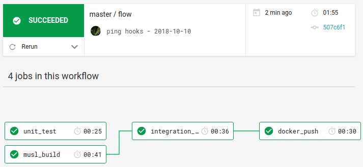

# Rust microservice setup with rocket and postgres diesel
[](https://circleci.com/gh/clux/webapp-rs/tree/master)
[](
https://hub.docker.com/r/clux/webapp-rs/)
[](http://microbadger.com/images/clux/webapp-rs)
[](https://hub.docker.com/r/clux/webapp-rs/tags/)

A JSON API microservice with database backing all running from a [<7MB container](./Dockerfile).

## Developing Easily
Install dependencies, setup `rustup` env, then start a dev postgres with credentials:

```sh
sudo pacman -S postgresql-libs # or distro equivalent
make setup
source env.sh
make db # runs postgres in a container
```

then run and test in parallel with:

```sh
make run
make test
```

This workflow is the fastest as it does not require waiting for docker builds, nor deal with a local installations of postgres. You just need to install `docker`, `postgresql-libs` to manage migrations in a container, and run against it with what's essentially `cargo run`.

## Using docker-compose
You can develop and test production equivalents without rust, without local postgres, without postgres libs, and without diesel-cli locally.

This is the production equivalent flow:

```sh
# Build the app with clux/muslrust
make compile
# Put the built binary into a container and compose with a db.
# Then, once the db is up, use clux/diesel-cli to run migrations:
source env.sh
make compose
# Verify
make test
```

## CI
Runs unit tests, musl build, intergration tests with docker compose and pushes to docker hub, all in <2 minutes (using a cache of rust target + registy directories).



## Using Kubernetes
Port to your templated wall of yaml of choice if you know what you are doing.

Note that the migration step can be done as part of lifecycle hooks on kubernetes. See the [diesel-cli](https://github.com/clux/diesel-cli) container for more info.

## Caveats
**NB:** With `docker-compose` our migration would have to wait for postgres to initialize, either via a sleep or a `psql` "select 1" attempt. See `make compose` for more info.

**NB:** The compile step is required before any build step, so `docker-compose up` would fail without it. It's possible to fix this by using a multistep docker build for the app, but it makes local build caching harder.
